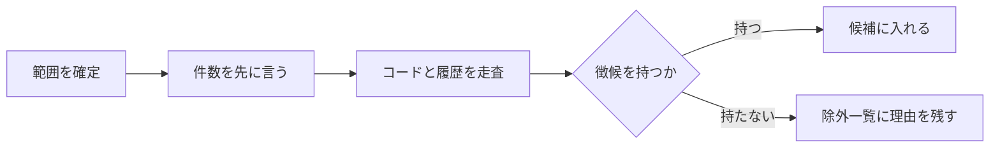

# codifier-collect — 収集の設計

## Needs

| spec | needs |
| ---- | ----- |
| [R1](../L2_specs/collection.md#R1) | コミット列と差分を辿る手順。revert と書き換えの前後を捨てた案として取る |
| [R2](../L2_specs/collection.md#R2) | 四つの徴候それぞれの判定手続き |
| [R3](../L2_specs/collection.md#R3) | 拾わなかったものと理由を戻り値に残す形 |
| [R4](../L2_specs/collection.md#R4) | 走査範囲を最初に確定させる問いと、件数の先出し |

## Parts

| target_name | target_file | IN | OUT |
| ----------- | ----------- | -- | --- |
| codifier-collect | skills/codifier-collect/SKILL.md | 走査範囲, コード, コミット履歴 | 決断の候補と除外一覧 |

### Relation

## Rules
- 範囲が決まるまで走査しない
    - リポジトリ全体を自らの判断で対象にしない
    - 由来: [徴候から自発的に収集する](../L4_decisions/collect-without-asking.md)
- 走査の途中で人に問わない
    - 判断は徴候の有無だけで行う
    - 由来: [徴候から自発的に収集する](../L4_decisions/collect-without-asking.md)
- コードだけを入力にしない
    - 履歴を読まずに決断を立てない
    - 由来: [決断はコードに無く、履歴にある](../L4_decisions/decisions-not-in-code.md)
- ファイルに書かない
    - 候補を返すだけで、`docs/codifier/` に触れない
    - 由来: [書き込みはオーケストレーターが持つ](../L4_decisions/orchestrator-writes.md)

## Decisions
- [徴候から自発的に収集する](../L4_decisions/collect-without-asking.md)
- [決断はコードに無く、履歴にある](../L4_decisions/decisions-not-in-code.md)
- [書き込みはオーケストレーターが持つ](../L4_decisions/orchestrator-writes.md)
- [スキルは仕事ごとに四つに割る](../L4_decisions/skill-per-job.md)

## References

### Designs

- [codifier](../L2_designs/_codifier.md)

### Structures

- [collection-signs](../L3_structures/collection-signs.md)
- [skill-composition](../L3_structures/skill-composition.md)

### Terms

- [sign](../L3_terms/sign.md)
- [decision](../L3_terms/decision.md)
