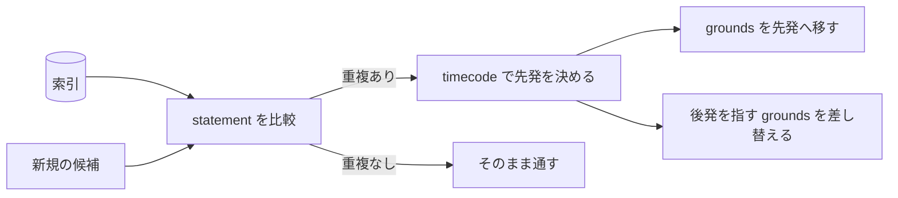

# codifier-disjoint — 互いに素の検査の設計

## Needs

| spec | needs |
| ---- | ----- |
| [R1](../L2_specs/disjointness.md#R1) | 索引の statement 列どうしを意味で突き合わせる比較。参照関係は重複と見なさない |
| [R2](../L2_specs/disjointness.md#R2) | timecode 列の小さい側を先発と決める規則と、後発の grounds を先発へ移す手順 |
| [R3](../L2_specs/disjointness.md#R3) | 後発を指す grounds を索引から探し、先発へ差し替える指示の組み立て |

## Parts

| target_name | target_file | IN | OUT |
| ----------- | ----------- | -- | --- |
| codifier-disjoint | skills/codifier-disjoint/SKILL.md | 索引, 新規の決断候補 | 重複の報告, 統合と繋ぎ直しの指示 |

### Relation

## Rules
- 比較は索引の statement 列だけで行う
    - 決断ファイルを全件開かない
    - 由来: [索引は CSV で持つ](../L4_decisions/index-is-csv.md)
- 先発は timecode で決める
    - CSV の行順で決めない。行順は作り直しのたびに変わりうる
    - 由来: [索引は決断発効時の timecode を持つ](../L4_decisions/index-holds-timecode.md)
- 参照関係を重複と見なさない
    - 一方が他方を根拠にしていることは、同じことを言っている証拠にならない
    - 由来: [決断は互いに素である](../L4_decisions/decisions-are-disjoint.md)
- 繋ぎ直しは一方向のみ
    - 後発を指していたものを先発へ向ける。逆向きの書き換えを行わない
    - 由来: [重複は先発に統合する](../L4_decisions/merge-into-the-earlier.md)
- ファイルに書かない
    - 指示を返すだけで、統合そのものは行わない
    - 由来: [書き込みはオーケストレーターが持つ](../L4_decisions/orchestrator-writes.md)

## Decisions
- [決断は互いに素である](../L4_decisions/decisions-are-disjoint.md)
- [重複は先発に統合する](../L4_decisions/merge-into-the-earlier.md)
- [索引は決断発効時の timecode を持つ](../L4_decisions/index-holds-timecode.md)
- [索引は CSV で持つ](../L4_decisions/index-is-csv.md)
- [書き込みはオーケストレーターが持つ](../L4_decisions/orchestrator-writes.md)

## References

### Designs

- [codifier](../L2_designs/_codifier.md)

### Structures

- [decision-removal](../L3_structures/decision-removal.md)
- [index-format](../L3_structures/index-format.md)

### Terms

- [merge](../L3_terms/merge.md)
- [statement](../L3_terms/statement.md)
- [index](../L3_terms/index.md)
