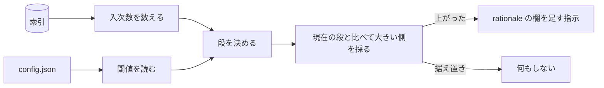

# codifier-escalate — 昇格の設計

## Needs

| spec | needs |
| ---- | ----- |
| [R1](../L2_specs/granularity.md#R1) | 索引の grounds 列を横断して入次数を数える集計 |
| [R2](../L2_specs/granularity.md#R2) | 入次数を三段のいずれかへ写す対応 |
| [R3](../L2_specs/granularity.md#R3) | 段が上がったとき rationale の欄を足す指示。他の欄は触らない |
| [R4](../L2_specs/granularity.md#R4) | 現在の粒度と算出値を比べ、大きい側を採る比較 |
| [R5](../L2_specs/granularity.md#R5) | `config.json` の読み出しと、欠けたときの既定値 |

## Parts

| target_name | target_file | IN | OUT |
| ----------- | ----------- | -- | --- |
| codifier-escalate | skills/codifier-escalate/SKILL.md | 索引, 設定 | 粒度の変更と欄の追加の指示 |
| 閾値の設定 | docs/codifier/config.json | - | - |

### Relation

## Rules
- 降格しない
    - 算出値が現在より小さくても、粒度を下げる指示を出さない
    - 由来: [エスカレーションは不可逆とする](../L4_decisions/escalation-is-irreversible.md)
- 粒度を人が指定できない
    - 入次数と閾値の外から粒度を受け取らない
    - 由来: [粒度は被参照数で決まる](../L4_decisions/granularity-from-reference-count.md)
- 閾値は設定から読む
    - 設定が無いときだけ既定値を使い、既定値を規則として扱わない
    - 由来: [エスカレーションの閾値は利用者が決める](../L4_decisions/thresholds-are-configurable.md)
- 設定は出力先の中から読む
    - `docs/codifier/config.json` 以外の場所を探さない
    - 由来: [設定は `docs/codifier/config.json` に置く](../L4_decisions/config-in-output-dir.md)
- ファイルを移動させない
    - 段が上がっても、欄を足すだけでパスを変えない
    - 由来: [出力は一列に並べる](../L4_decisions/flat-output-layout.md)
- ファイルに書かない
    - 指示を返すだけで、欄の追加そのものは行わない
    - 由来: [書き込みはオーケストレーターが持つ](../L4_decisions/orchestrator-writes.md)

## Decisions
- [粒度は被参照数で決まる](../L4_decisions/granularity-from-reference-count.md)
- [粒度は choice / convention / principle の三段とする](../L4_decisions/three-granularities.md)
- [粒度が上がるほど記載内容が増える](../L4_decisions/content-grows-with-granularity.md)
- [エスカレーションは不可逆とする](../L4_decisions/escalation-is-irreversible.md)
- [エスカレーションの閾値は利用者が決める](../L4_decisions/thresholds-are-configurable.md)
- [設定は `docs/codifier/config.json` に置く](../L4_decisions/config-in-output-dir.md)
- [出力は一列に並べる](../L4_decisions/flat-output-layout.md)
- [書き込みはオーケストレーターが持つ](../L4_decisions/orchestrator-writes.md)

## References

### Designs

- [codifier](../L2_designs/_codifier.md)

### Structures

- [granularity-ladder](../L3_structures/granularity-ladder.md)
- [configurable-surface](../L3_structures/configurable-surface.md)
- [index-format](../L3_structures/index-format.md)

### Terms

- [escalation](../L3_terms/escalation.md)
- [granularity](../L3_terms/granularity.md)
- [rationale](../L3_terms/rationale.md)
- [index](../L3_terms/index.md)
