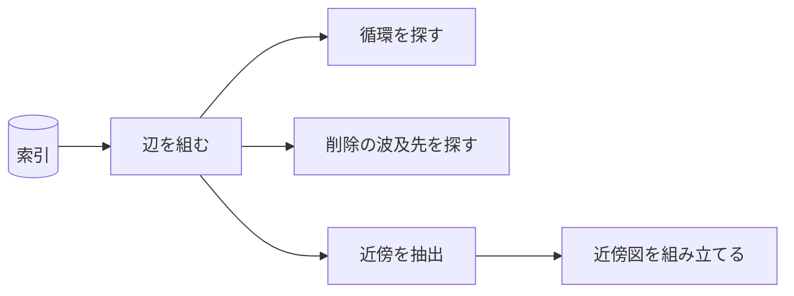

# codifier-graph — グラフ保守の設計

## Needs

| spec | needs |
| ---- | ----- |
| [R1](../L2_specs/graph-maintenance.md#R1) | 索引の grounds 列から辺を組み、循環を探す走査 |
| [R2](../L2_specs/graph-maintenance.md#R2) | 粒度による参照可否の判定を持たないこと |
| [R3](../L2_specs/graph-maintenance.md#R3) | 覆った箇所の打ち消しと、全て覆ったときの削除指示 |
| [R4](../L2_specs/graph-maintenance.md#R4) | 削除対象を指す grounds の行を特定する検索 |
| [R5](../L2_specs/graph-maintenance.md#R5) | 出る辺を三ホップ、入る辺を一ホップ辿る抽出 |

## Parts

| target_name | target_file | IN | OUT |
| ----------- | ----------- | -- | --- |
| codifier-graph | skills/codifier-graph/SKILL.md | 索引 | 検査結果, 近傍図, 削除と打ち消しの指示 |

### Relation

## Rules
- 索引だけを読む
    - 決断ファイルを全件開かない
    - 由来: [索引は CSV で持つ](../L4_decisions/index-is-csv.md)
- 粒度で参照を制限しない
    - choice が principle を直接指す形を拒否しない
    - 由来: [参照はグラフであり、循環しない](../L4_decisions/references-form-a-dag.md)
- 波及は一行で止める
    - 削除された決断を指す行だけを消し、参照元は覆さない
    - 由来: [削除された決断への参照は連携して消す](../L4_decisions/cascade-delete-references.md)
- ホップ数を粒度で変えない
    - 三段のどれでも出三ホップ・入一ホップとする
    - 由来: [近傍図は出る辺を三ホップ、入る辺を一ホップとする](../L4_decisions/hop-limit-asymmetric.md)
- 図を書き出さない
    - 組み立てた図は返すだけで、ファイルに触れない
    - 由来: [書き込みはオーケストレーターが持つ](../L4_decisions/orchestrator-writes.md)

## Decisions
- [参照はグラフであり、循環しない](../L4_decisions/references-form-a-dag.md)
- [覆った内容は打ち消し線で消す](../L4_decisions/overturned-is-struck-through.md)
- [削除された決断への参照は連携して消す](../L4_decisions/cascade-delete-references.md)
- [近傍図は出る辺を三ホップ、入る辺を一ホップとする](../L4_decisions/hop-limit-asymmetric.md)
- [近傍の参照図は各決断が持つ](../L4_decisions/local-graph-in-each-decision.md)
- [索引は CSV で持つ](../L4_decisions/index-is-csv.md)
- [書き込みはオーケストレーターが持つ](../L4_decisions/orchestrator-writes.md)

## References

### Designs

- [codifier](../L2_designs/_codifier.md)

### Structures

- [reference-graph](../L3_structures/reference-graph.md)
- [neighborhood-graph](../L3_structures/neighborhood-graph.md)
- [decision-removal](../L3_structures/decision-removal.md)

### Terms

- [reference](../L3_terms/reference.md)
- [neighborhood](../L3_terms/neighborhood.md)
- [overturn](../L3_terms/overturn.md)
- [index](../L3_terms/index.md)
