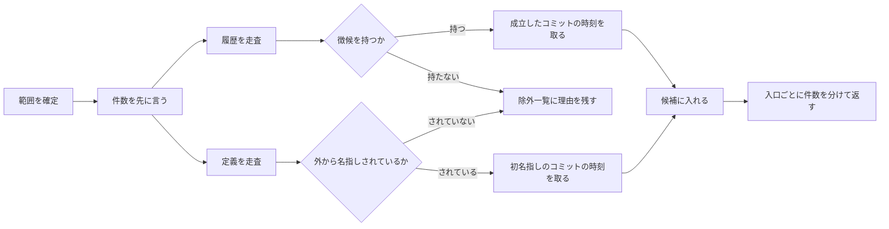

# codifier-collect — 収集の設計

## Needs

| spec | needs |
| ---- | ----- |
| [R1](../L2_specs/collection.md#R1) | 二本の走査を分けて持つ手順。履歴側はコミット列と差分を辿り、定義側は定義とその名指し先を辿る |
| [R2](../L2_specs/collection.md#R2) | 四つの徴候それぞれの判定手続き |
| [R3](../L2_specs/collection.md#R3) | 拾わなかったものと理由を戻り値に残す形 |
| [R4](../L2_specs/collection.md#R4) | 走査範囲を最初に確定させる問いと、件数の先出し |
| [R5](../L2_specs/collection.md#R5) | 徴候が成立したコミットと、初めて外から名指しされたコミットを特定し、その時刻を取り出す |
| [R6](../L2_specs/collection.md#R6) | 定義の位置と、その名前が現れる位置を突き合わせ、定義スコープの外かどうかを判定する手続き |
| [R7](../L2_specs/collection.md#R7) | 同じ対象を指す別綴りを突き合わせる手続きと、確定事項に四項を埋める型 |
| [R8](../L2_specs/collection.md#R8) | 既にある命名の条項を引き当て、改名を覆りとして戻す形 |
| [R9](../L2_specs/collection.md#R9) | 候補を入口ごとに分けて数える戻り値の形 |

## Parts

| target_name | target_file | IN | OUT |
| ----------- | ----------- | -- | --- |
| codifier-collect | skills/codifier-collect/SKILL.md | 走査範囲, コード, コミット履歴 | 条項の候補（発効時刻つき）と除外一覧 |

### Relation

## Rules
- 範囲が決まるまで走査しない
    - リポジトリ全体を自らの判断で対象にしない
    - 由来: [徴候から自発的に収集する](../L4_decisions/collect-without-asking.md)
- 走査の途中で人に問わない
    - 判断は徴候の有無だけで行う
    - 由来: [徴候から自発的に収集する](../L4_decisions/collect-without-asking.md)
- コードだけを入力にしない
    - 履歴を読まずに、捨てた案を要する条項を立てない
    - 由来: [捨てた案は履歴にしかない](../L4_decisions/decisions-not-in-code.md)
- 定義を徴候の列に混ぜない
    - 定義側の候補に四つの徴候を要求しない。走査も戻り値も入口ごとに分ける
    - 由来: [定義は徴候ではなく、第二の入口とする](../L4_decisions/definition-is-the-second-entry.md)
- 可視性の規則を判定に使わない
    - 名指しの有無だけで篩う。言語ごとの export 相当を実装が知らないでよい形にする
    - 由来: [篩は、定義スコープの外から名指しされていること](../L4_decisions/sieve-is-naming-from-outside.md)
- 名指しの数え先はコードに限る
    - 本体とテストを数え、ドキュメントを数えない
    - 由来: [篩は、定義スコープの外から名指しされていること](../L4_decisions/sieve-is-naming-from-outside.md)
- 命名を規則へ畳まない
    - 綴りの傾向を見つけても一枚にまとめず、名前ごとに候補を立てる
    - 由来: [公開された識別子の命名は、個別に choice として拾う](../L4_decisions/naming-is-a-choice.md)
- 改名で名前を書き換えない
    - 既にある命名の条項を覆りとして戻す。改名コミットは根拠の実装欄へ回す
    - 由来: [公開識別子の改名は覆りとして扱う](../L4_decisions/rename-is-an-overturn.md)
- 発効時刻は履歴から取る
    - 実行時刻を使わない。二度走らせても同じ値になる
    - 由来: [索引は条項発効時の timecode を持つ](../L4_decisions/index-holds-timecode.md)
- ファイルに書かない
    - 候補を返すだけで、`docs/codifier/` に触れない
    - 由来: [書き込みはオーケストレーターが持つ](../L4_decisions/orchestrator-writes.md)

## Decisions
- [徴候から自発的に収集する](../L4_decisions/collect-without-asking.md)
- [捨てた案は履歴にしかない](../L4_decisions/decisions-not-in-code.md)
- [定義は徴候ではなく、第二の入口とする](../L4_decisions/definition-is-the-second-entry.md)
- [篩は、定義スコープの外から名指しされていること](../L4_decisions/sieve-is-naming-from-outside.md)
- [公開された識別子の命名は、個別に choice として拾う](../L4_decisions/naming-is-a-choice.md)
- [公開識別子の改名は覆りとして扱う](../L4_decisions/rename-is-an-overturn.md)
- [索引は条項発効時の timecode を持つ](../L4_decisions/index-holds-timecode.md)
- [書き込みはオーケストレーターが持つ](../L4_decisions/orchestrator-writes.md)
- [スキルは仕事ごとに四つに割る](../L4_decisions/skill-per-job.md)

## References

### Designs

- [codifier](../L2_designs/codifier.md)

### Structures

- [collection-signs](../L3_structures/collection-signs.md)
- [collection-definition](../L3_structures/collection-definition.md)
- [skill-composition](../L3_structures/skill-composition.md)

### Terms

- [sign](../L3_terms/sign.md)
- [definition](../L3_terms/definition.md)
- [identifier](../L3_terms/identifier.md)
- [decision](../L3_terms/decision.md)
- [index](../L3_terms/index.md)
