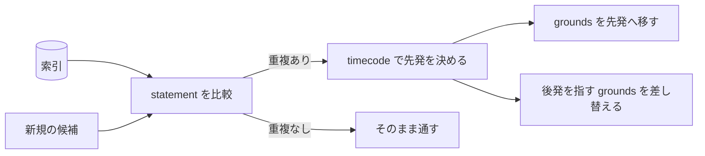

# codifier-disjoint — 互いに素の検査の設計

## Tasks

### T1 statement 列どうしを意味で突き合わせる

- Means: checklist
- 同じ意味の statement を持つ二行と、一方が他方を grounds に挙げる二行を索引に与え、
  前者だけが組として出ることを見る

### T2 timecode の小さい側を残し、後発の grounds を移す

- Means: checklist
- timecode の異なる重複二行を与え、小さい側が残り、後発だけが持っていた grounds が
  残った側に付くことを見る

### T3 後発を指す grounds を索引から探し、差し替えを組み立てる

- Means: checklist
- 後発を grounds に挙げる第三の行を置き、返る指示にその行の差し替えが現れることを見る

## Parts

| target_name | target_file | IN | OUT |
| ----------- | ----------- | -- | --- |
| codifier-disjoint | skills/codifier-disjoint/SKILL.md | 索引, 新規の条項候補 | 重複の報告, 統合と繋ぎ直しの指示 |

### Relation

## Rules
- 比較は索引の statement 列だけで行う
    - 条項ファイルを全件開かない
    - 由来: [索引は CSV で持つ](../L4_decisions/index-is-csv.md)
- 先発は timecode で決める
    - CSV の行順で決めない。行順は作り直しのたびに変わりうる
    - 由来: [索引は条項発効時の timecode を持つ](../L4_decisions/index-holds-timecode.md)
- 参照関係を重複と見なさない
    - 一方が他方を根拠にしていることは、同じことを言っている証拠にならない
    - 由来: [条項は互いに素である](../L4_decisions/articles-are-disjoint.md)
- 繋ぎ直しは一方向のみ
    - 後発を指していたものを先発へ向ける。逆向きの書き換えを行わない
    - 由来: [重複は先発に統合する](../L4_decisions/merge-into-the-earlier.md)
- ファイルに書かない
    - 指示を返すだけで、統合そのものは行わない
    - 由来: [書き込みはオーケストレーターが持つ](../L4_decisions/orchestrator-writes.md)

## Decisions
- [条項は互いに素である](../L4_decisions/articles-are-disjoint.md)
- [重複は先発に統合する](../L4_decisions/merge-into-the-earlier.md)
- [索引は条項発効時の timecode を持つ](../L4_decisions/index-holds-timecode.md)
- [索引は CSV で持つ](../L4_decisions/index-is-csv.md)
- [書き込みはオーケストレーターが持つ](../L4_decisions/orchestrator-writes.md)

## References

### Designs

- [codifier](../L2_designs/codifier.md)

### Structures

- [article-removal](../L3_structures/article-removal.md)
- [index-format](../L3_structures/index-format.md)

### Terms

- [merge](../L3_terms/merge.md)
- [statement](../L3_terms/statement.md)
- [index](../L3_terms/index.md)
