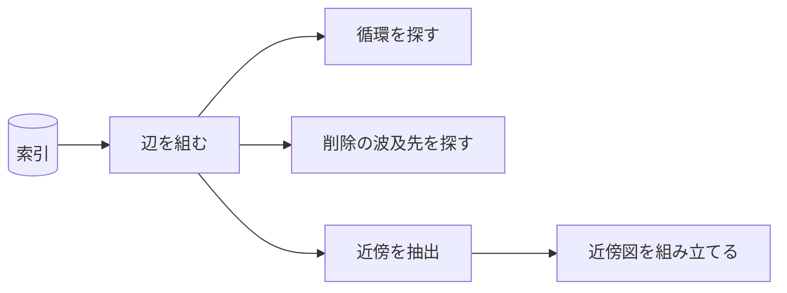

# codifier-graph — グラフ保守の設計

## Tasks

### T1 索引の grounds 列から辺を組み、循環を探す

- Means: checklist
- 循環する grounds を含む索引を与え、循環が報告されることを見る

### T2 粒度による参照可否の判定を持たない

- Means: checklist
- 下の段が上の段を参照する行を与え、それが違反として報告されないことを見る

### T3 覆った箇所を打ち消し、全て覆ったときに削除を指示する

- Means: checklist
- 一部が覆った条項と全て覆った条項を与え、前者は行が残り、後者にファイル削除の指示が付くことを見る

### T4 削除対象を指す grounds の行を特定する

- Means: checklist
- 削除される条項を grounds に挙げる行を置き、その行が特定されることを見る

### T5 出る辺を三ホップ、入る辺を一ホップ辿って抽出する

- Means: checklist
- 四ホップ先まで繋がるグラフを与え、出る側が三ホップで止まり、入る側が一ホップで止まることを見る

## Parts

| target_name | target_file | IN | OUT |
| ----------- | ----------- | -- | --- |
| codifier-graph | skills/codifier-graph/SKILL.md | 索引, 確定した集合 | 検査結果, 近傍図, 削除と打ち消しの指示 |

### Relation

## Rules
- 索引だけを読む
    - 条項ファイルを全件開かない
    - 由来: [索引は CSV で持つ](../L4_decisions/index-is-csv.md)
- 粒度で参照を制限しない
    - choice が principle を直接指す形を拒否しない
    - 由来: [参照はグラフであり、循環しない](../L4_decisions/references-form-a-dag.md)
- 波及は一行で止める
    - 削除された条項を指す行だけを消し、参照元は覆さない
    - 由来: [削除された条項への参照は連携して消す](../L4_decisions/cascade-delete-references.md)
- ホップ数を粒度で変えない
    - 三段のどれでも出三ホップ・入一ホップとする
    - 由来: [近傍図は出る辺を三ホップ、入る辺を一ホップとする](../L4_decisions/hop-limit-asymmetric.md)
- 図を書き出さない
    - 組み立てた図は返すだけで、ファイルに触れない
    - 由来: [書き込みはオーケストレーターが持つ](../L4_decisions/orchestrator-writes.md)

## Decisions
- [参照はグラフであり、循環しない](../L4_decisions/references-form-a-dag.md)
- [覆った内容は打ち消し線で消す](../L4_decisions/overturned-is-struck-through.md)
- [削除された条項への参照は連携して消す](../L4_decisions/cascade-delete-references.md)
- [近傍図は出る辺を三ホップ、入る辺を一ホップとする](../L4_decisions/hop-limit-asymmetric.md)
- [近傍の参照図は各条項が持つ](../L4_decisions/local-graph-in-each-article.md)
- [索引は CSV で持つ](../L4_decisions/index-is-csv.md)
- [書き込みはオーケストレーターが持つ](../L4_decisions/orchestrator-writes.md)

## References

### Designs

- [codifier](../L2_designs/codifier.md)

### Structures

- [reference-graph](../L3_structures/reference-graph.md)
- [neighborhood-graph](../L3_structures/neighborhood-graph.md)
- [article-removal](../L3_structures/article-removal.md)

### Terms

- [reference](../L3_terms/reference.md)
- [neighborhood](../L3_terms/neighborhood.md)
- [overturn](../L3_terms/overturn.md)
- [index](../L3_terms/index.md)
