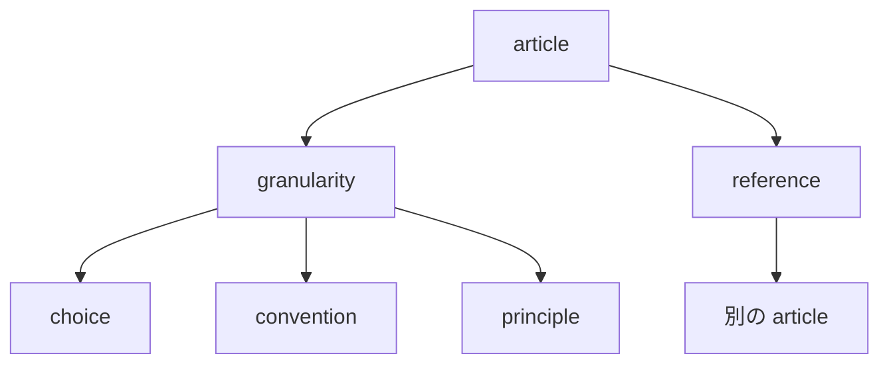

# article-attributes — 条項が持つ属性

## Diagrams

### D1 条項の三属性

条項は粒度と参照の二つを持つ。種別を持たないのは、他の案を試した跡が grounds から
読めるためで、欄にすると写しになる。
参照だけが他の条項を指し、粒度は条項自身の属性で閉じる。
属性が二つより増えることは、この図に行が増えることで分かる。

## Decisions
- [集める単位は条項とし、decision と definition に分ける](../L4_decisions/article-is-the-collected-unit.md)
- [条項は種別を持たない](../L4_decisions/no-kind-attribute.md)
- [条項は互いに素である](../L4_decisions/articles-are-disjoint.md)
- [粒度は choice / convention / principle の三段とする](../L4_decisions/three-granularities.md)

## References

### Terms

- [article](../L3_terms/article.md)
- [granularity](../L3_terms/granularity.md)
- [reference](../L3_terms/reference.md)
- [grounds](../L3_terms/grounds.md)
