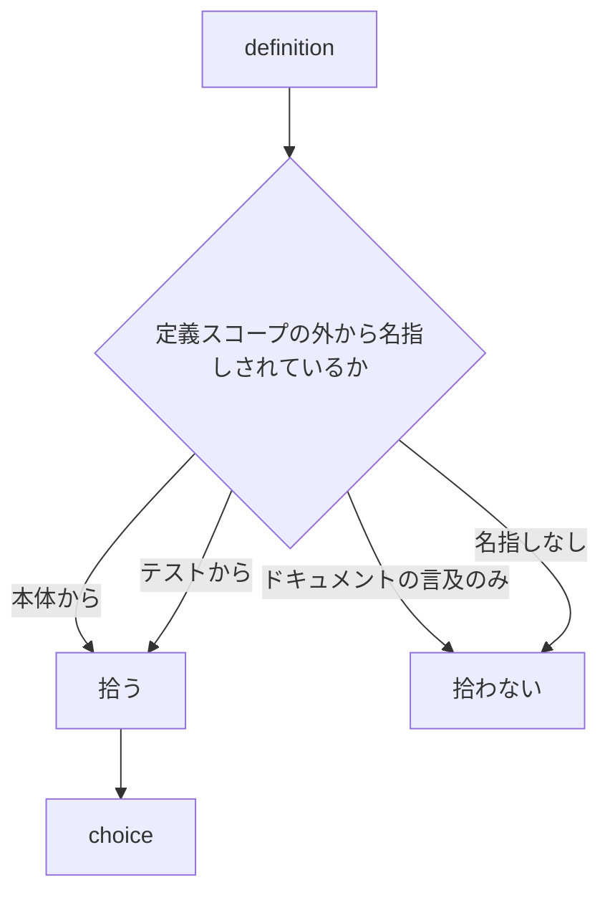
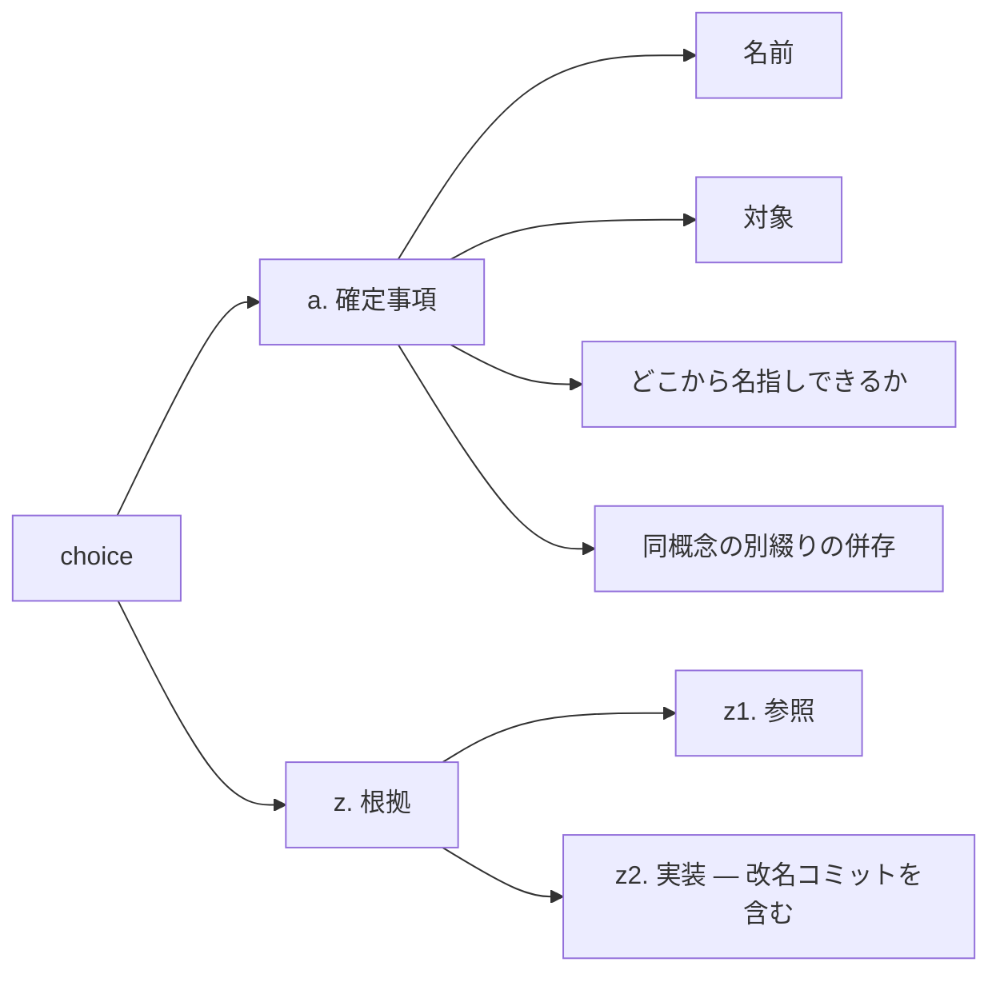
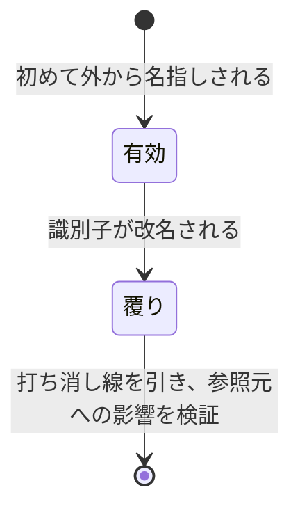

# collection-definition — 定義入口の篩と、拾う中身

## Diagrams

### D1 篩

定義そのものは篩にならない。関数の中の束縛も定義であるため、篩は名指しの側に置く。
外から名指しされていれば、その識別子は公開されている。逆は成り立たないが、誰も名指し
していない公開識別子はまだ何も壊しておらず、決まっていない。
ドキュメントの言及を数えないのは、壊れても気づかれず、変えられないことの証拠に
ならないため。名指しの数え先が増減すれば、この図の行が増減する。

### D2 命名の choice が持つもの

拾うのは個別の名前であり、命名規則ではない。規則は同じ形が反復すれば escalation が
convention へ上げる。別綴りの併存は命名がまだ決まっていない状態を指すが、併存している
事実自体は確定しているため拾い、解消は利用者に残す。
過去の改名は捨てた案そのものだが、理由欄を得るために粒度を上げず、`z2. 実装` に置く。
粒度は被参照数だけが決める。

### D3 改名が起きたときの遷移

確定事項の名前を静かに書き換えない。書き換えると捨てた案が記録されず、改名があったこと
自体が消える。公開識別子の改名はそれを名指ししていた全箇所を壊す変更であり、覆りが
想定する影響そのものにあたる。timecode は初めて外から名指しされたコミットの時刻で、
これは篩が成立した時刻にあたる。

## Decisions
- [篩は、定義スコープの外から名指しされていること](../L4_decisions/sieve-is-naming-from-outside.md)
- [公開された識別子の命名は、個別に choice として拾う](../L4_decisions/naming-is-a-choice.md)
- [公開識別子の改名は覆りとして扱う](../L4_decisions/rename-is-an-overturn.md)

## References

### Structures

- [collection-signs](../L3_structures/collection-signs.md)

### Terms

- [definition](../L3_terms/definition.md)
- [identifier](../L3_terms/identifier.md)
- [choice](../L3_terms/choice.md)
- [overturn](../L3_terms/overturn.md)
- [timecode](../L3_terms/timecode.md)
