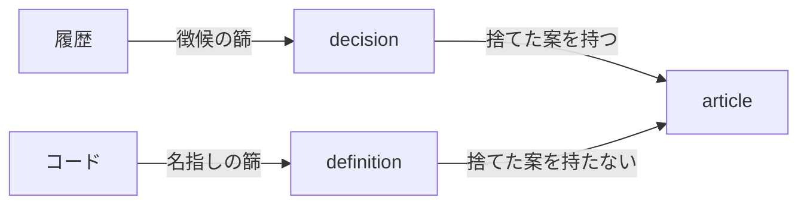
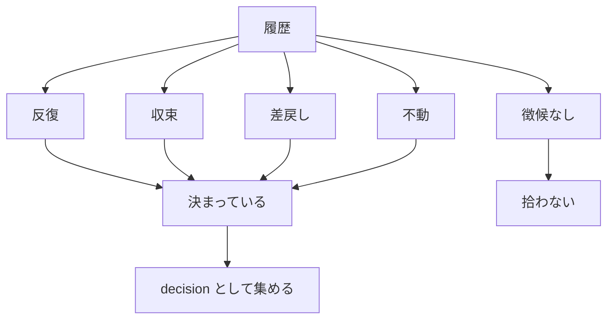

# collection-signs — 収集の入口と徴候

## Diagrams

### D1 二つの入口

入口は二つある。履歴からは decision を、コードからは definition を拾い、どちらも条項になる。
分かれ目は捨てた案を持つか否かで、入口の別はその結果にすぎない。
捨てた案を要する条項はコード単体からは復元できないが、コードが指している条項の写像は書ける。
篩は入口ごとに別で、徴候は履歴側にしか掛からない。
入口が増減すれば、この図の行が増減する。

### D2 徴候による判定

徴候は履歴から判定する。四つで、いずれか一つを持てば決まっているものとして集める。
四つとも持たないものは拾わない。これが人への問い合わせを置き換える篩にあたる。
徴候は四つのままとし、増やさない。定義はこの列に並ばず、第二の入口として立つ。
定義の入口の篩はこの図に無く、別の構造が持つ。

## Decisions
- [集める単位は条項とし、decision と definition に分ける](../L4_decisions/article-is-the-collected-unit.md)
- [徴候から自発的に収集する](../L4_decisions/collect-without-asking.md)
- [捨てた案は履歴にしかない](../L4_decisions/decisions-not-in-code.md)
- [定義は徴候ではなく、第二の入口とする](../L4_decisions/definition-is-the-second-entry.md)

## References

### Terms

- [sign](../L3_terms/sign.md)
- [definition](../L3_terms/definition.md)
- [decision](../L3_terms/decision.md)
- [article](../L3_terms/article.md)
