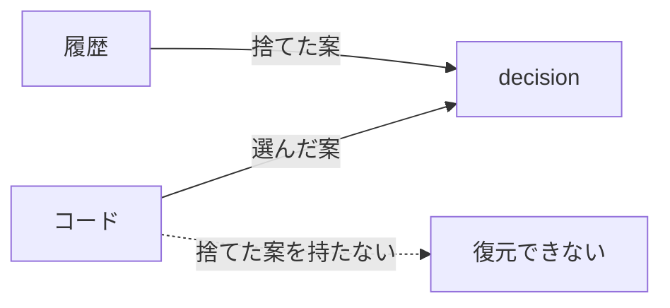
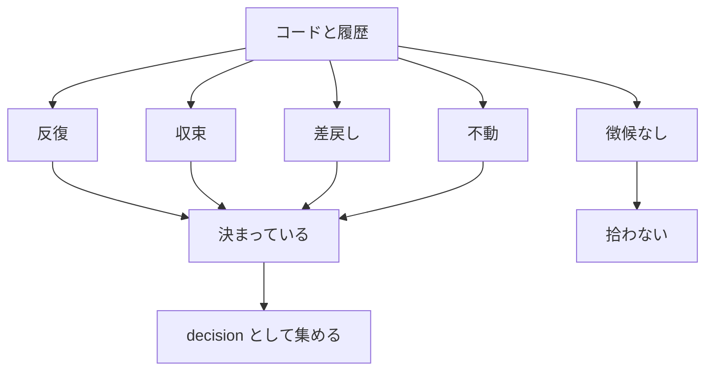

# collection-signs — 収集の入力と徴候

## Diagrams

### D1 入力から復元できるもの

決断は選んだ案と捨てた案の対で成立する。コードは選んだ案しか保存しないため、
コード単体からは復元できない。差戻し・書き換えの前後が捨てた案にあたり、履歴が持つ。
入力が二つあることが、コードだけを読む手法との違いになる。

### D2 徴候による判定

徴候は四つで、いずれか一つを持てば決まっているものとして集める。
四つとも持たないものは拾わない。これが人への問い合わせを置き換える篩にあたる。
徴候が増減すれば、この図の行が増減する。

## Decisions
- [徴候から自発的に収集する](../L4_decisions/collect-without-asking.md)
- [決断はコードに無く、履歴にある](../L4_decisions/decisions-not-in-code.md)

## References

### Terms

- [sign](../L3_terms/sign.md)
- [decision](../L3_terms/decision.md)
