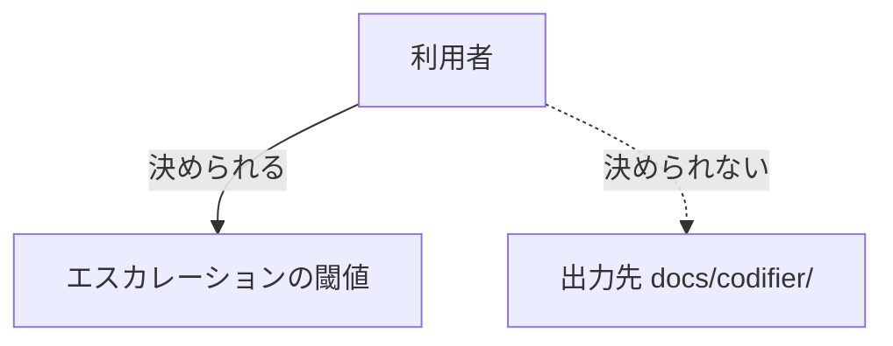

# configurable-surface — 利用者が触れる面

## Diagrams

### D1 設定できるものとできないもの

利用者が触れるのは閾値だけで、出力先は固定する。
誤ったときの被害が違う。閾値の誤りは決断の粒度が変わるだけだが、
出力先の誤りは既にあるドキュメント群を上書きする。
触れる面が増減すれば、この図の行が増減する。

## Decisions
- [出力先は固定する](../L4_decisions/output-path-is-fixed.md)
- [エスカレーションの閾値は利用者が決める](../L4_decisions/thresholds-are-configurable.md)

## References

### Terms

- [escalation](../L3_terms/escalation.md)
