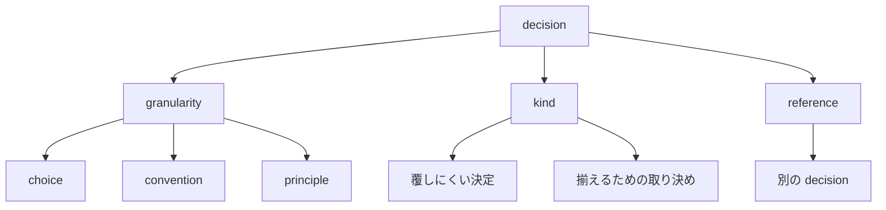
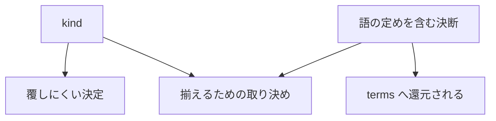

# decision-attributes — 決断が持つ属性

## Diagrams

### D1 決断の三属性

決断は粒度・種別・参照の三つを持つ。粒度と種別は直交する軸で、
粒度が大きい決断が必ず覆しにくいわけではない。
参照だけが他の決断を指し、残る二つは決断自身の属性で閉じる。
属性が三つより増えることは、この図に行が増えることで分かる。

### D2 種別に定義を置かない

kind から出る辺は二本しかない。三つ目を置かないことは、行が増えないことで分かる。
語をどう定めるかは、別の定義でも系が動くため K2 として判定できる。
種別を増やさなくても還元先が terms に決まるため、三つ目を要しない。
codifier は定義を観測できないため、種別に置けば埋められない欄ができる。

## Decisions
- [定義は決断の種別にしない](../L4_decisions/definition-is-not-a-kind.md)
- [決断は互いに素である](../L4_decisions/decisions-are-disjoint.md)
- [粒度は choice / convention / principle の三段とする](../L4_decisions/three-granularities.md)

## References

### Terms

- [decision](../L3_terms/decision.md)
- [kind](../L3_terms/kind.md)
- [granularity](../L3_terms/granularity.md)
- [reference](../L3_terms/reference.md)
