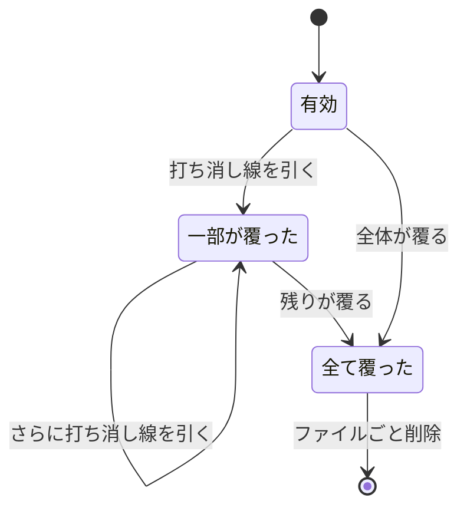
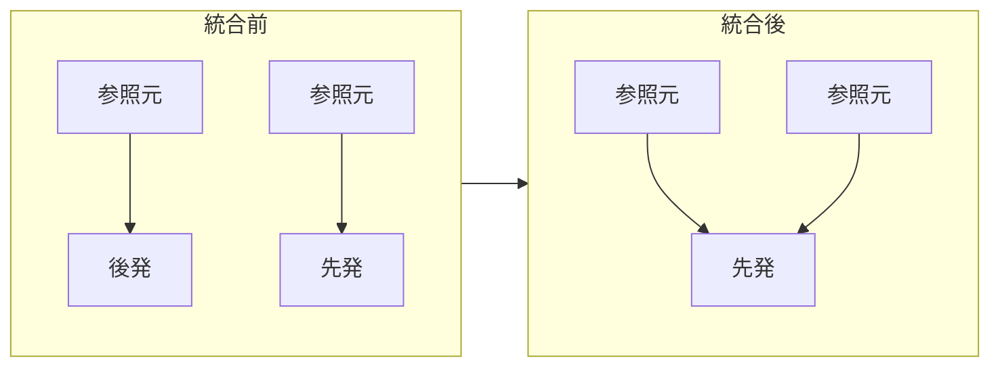

# decision-removal — 決断が消える経路

## Diagrams

### D1 覆りの状態遷移

打ち消し線を引いた行は残るため、何が覆ったかを後から読める。
全て覆ったときだけファイルが消える。有効な決断の中に無効な一枚が混ざるのを防ぐため。
戻る矢印が無く、覆った内容が有効に戻る経路は無い。

### D2 統合と参照の繋ぎ直し

重複を検出したとき、先発を残し後発を消す。後発を参照していた決断は先発へ繋ぎ直す。
先発の被参照数が増えるため、統合がエスカレーションを引き起こすことがある。
後発優先にすると繋ぎ直しが両方向に生じるため、向きを先発に固定している。

## Decisions
- [覆った内容は打ち消し線で消す](../L4_decisions/overturned-is-struck-through.md)
- [重複は先発に統合する](../L4_decisions/merge-into-the-earlier.md)
- [決断は互いに素である](../L4_decisions/decisions-are-disjoint.md)

## References

### Structures

- [reference-graph](../L3_structures/reference-graph.md)

### Terms

- [overturn](../L3_terms/overturn.md)
- [merge](../L3_terms/merge.md)
- [decision](../L3_terms/decision.md)
- [reference](../L3_terms/reference.md)
