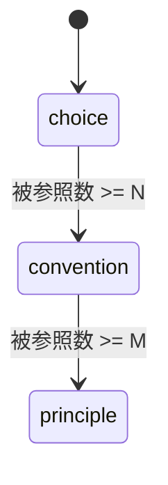
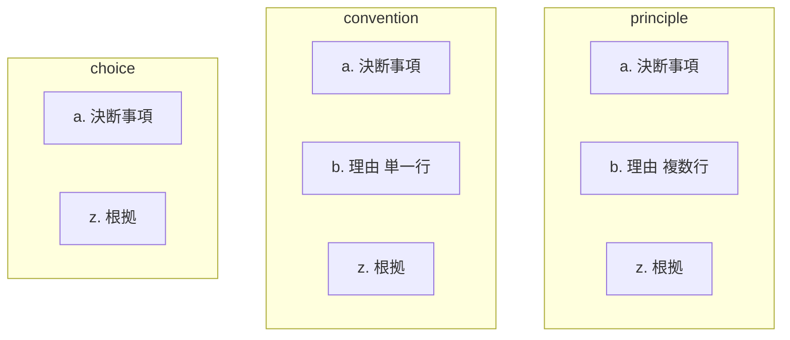

# granularity-ladder — 粒度の段とエスカレーション

## Diagrams

### D1 粒度の遷移

三段しかなく、遷移は下から上への二本だけ。
戻る矢印が無いことがエスカレーションの不可逆を表す。
N と M は利用者が決める閾値で、既定値を持つが規則ではない。
段が増減すれば状態が増減し、降格を認めれば逆向きの矢印が現れる。

### D2 粒度ごとの記載内容

粒度が上がるほど欄が増える。増えるのは理由だけで、決断事項と根拠は三段に共通する。
choice に理由の欄が無いのは、誰も拠って立っていない決断に説明責任が生じないため。
不可逆であることと合わせると、欄は増える方向にしか変わらない。

## Decisions
- [粒度は choice / convention / principle の三段とする](../L4_decisions/three-granularities.md)
- [粒度が上がるほど記載内容が増える](../L4_decisions/content-grows-with-granularity.md)
- [エスカレーションは不可逆とする](../L4_decisions/escalation-is-irreversible.md)
- [エスカレーションの閾値は利用者が決める](../L4_decisions/thresholds-are-configurable.md)
- [粒度は被参照数で決まる](../L4_decisions/granularity-from-reference-count.md)

## References

### Terms

- [granularity](../L3_terms/granularity.md)
- [choice](../L3_terms/choice.md)
- [convention](../L3_terms/convention.md)
- [principle](../L3_terms/principle.md)
- [escalation](../L3_terms/escalation.md)
