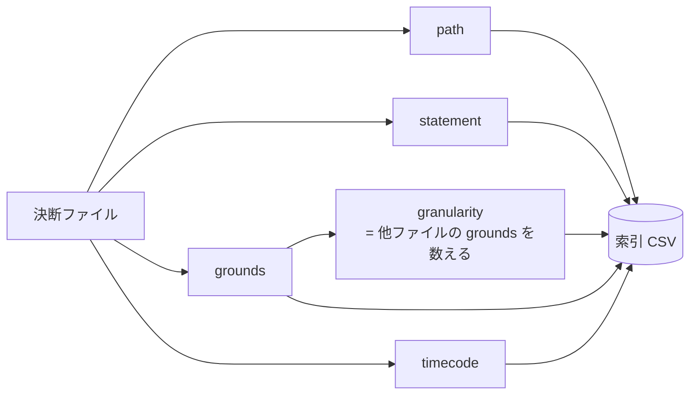
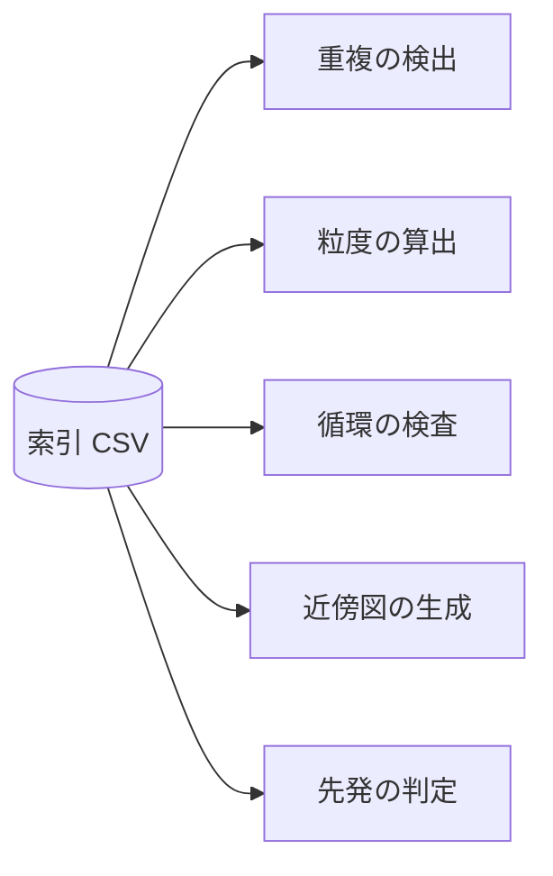

# index-format — 索引の形

## Diagrams

### D1 列と出処

五列すべてが決断ファイルから導かれる。索引そのものは何も決めない。
granularity だけは一枚では出ず、全ファイルの grounds を数えて決まる。
入次数を列に持たないのは、grounds 列から数えられるため。
列が増減すれば、この図に行が増減する。

### D2 索引を読む側

全決断を横断する処理は索引だけを読む。決断ファイルを全件開かない。
索引が古いと四つすべてが誤るため、実行のたびに作り直す。

## Decisions
- [索引は CSV で持つ](../L4_decisions/index-is-csv.md)
- [索引は決断発効時の timecode を持つ](../L4_decisions/index-holds-timecode.md)
- [生成された箇所は毎回書き直す](../L4_decisions/generated-parts-are-rewritten.md)
- [粒度は被参照数で決まる](../L4_decisions/granularity-from-reference-count.md)

## References

### Terms

- [index](../L3_terms/index.md)
- [statement](../L3_terms/statement.md)
- [grounds](../L3_terms/grounds.md)
- [granularity](../L3_terms/granularity.md)
