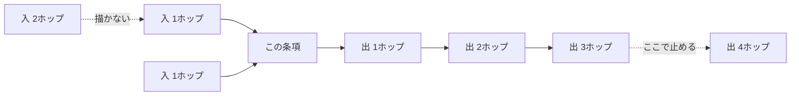

# neighborhood-graph — 近傍図の範囲

## Diagrams

### D1 出入りで深さが違う

自分が根拠にした側は三ホップ、自分を根拠にしている側は一ホップだけ描く。
入る辺を深く辿ると、入次数が大きい条項ほど図が広がる。入次数は粒度そのものなので、
principle ほど読めない図を持つことになる。出る辺の数は粒度に依らないため広がらない。
粒度ごとにホップ数を変えないので、この図は三段のどれでも同じ形になる。

## Decisions
- [近傍図は出る辺を三ホップ、入る辺を一ホップとする](../L4_decisions/hop-limit-asymmetric.md)
- [近傍の参照図は各条項が持つ](../L4_decisions/local-graph-in-each-article.md)

## References

### Structures

- [reference-graph](../L3_structures/reference-graph.md)

### Terms

- [neighborhood](../L3_terms/neighborhood.md)
- [granularity](../L3_terms/granularity.md)
- [reference](../L3_terms/reference.md)
