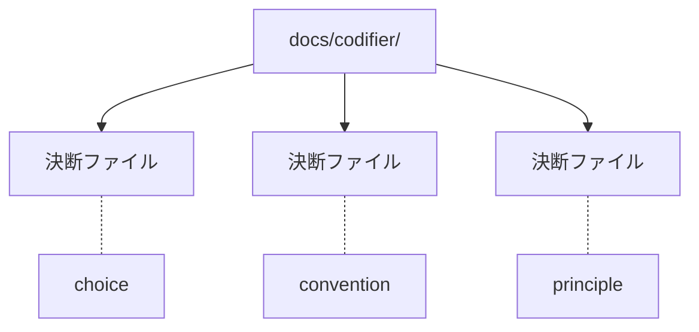

# output-layout — 出力先の配置

## Diagrams

### D1 一列の配置

粒度ごとにディレクトリを分けず、決断を一列に置く。
実線が配置、破線が各ファイルの粒度で、粒度は位置に現れない。
エスカレーションで粒度が変わってもファイルは動かないため、外部からの参照パスが変わらない。
ディレクトリが増えれば、この図に階層が現れる。

## Decisions
- [出力は一列に並べる](../L4_decisions/flat-output-layout.md)
- [出力先は固定する](../L4_decisions/output-path-is-fixed.md)
- [エスカレーションは不可逆とする](../L4_decisions/escalation-is-irreversible.md)

## References

### Terms

- [granularity](../L3_terms/granularity.md)
- [escalation](../L3_terms/escalation.md)
- [choice](../L3_terms/choice.md)
- [convention](../L3_terms/convention.md)
- [principle](../L3_terms/principle.md)
