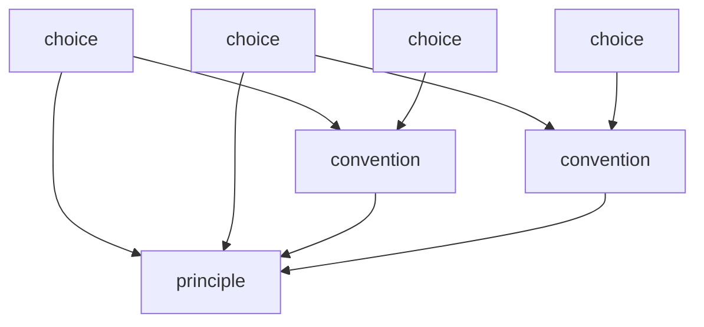

# reference-graph — 参照の形

## Diagrams

### D1 参照グラフ

矢印は参照の向きで、根拠にした側へ引く。入ってくる矢印の数がその条項の粒度になる。
層構造ではない。choice が convention を経ずに principle を直接参照してよい。
木ではないため、一つの条項が複数から参照される。それが粒度の定義そのものにあたる。
循環が無いことは、この図が有向非巡回グラフとして描けること自体で確かめられる。

## Decisions
- [参照はグラフであり、循環しない](../L4_decisions/references-form-a-dag.md)
- [粒度は被参照数で決まる](../L4_decisions/granularity-from-reference-count.md)
- [条項は互いに素である](../L4_decisions/articles-are-disjoint.md)

## References

### Terms

- [reference](../L3_terms/reference.md)
- [granularity](../L3_terms/granularity.md)
- [choice](../L3_terms/choice.md)
- [convention](../L3_terms/convention.md)
- [principle](../L3_terms/principle.md)
