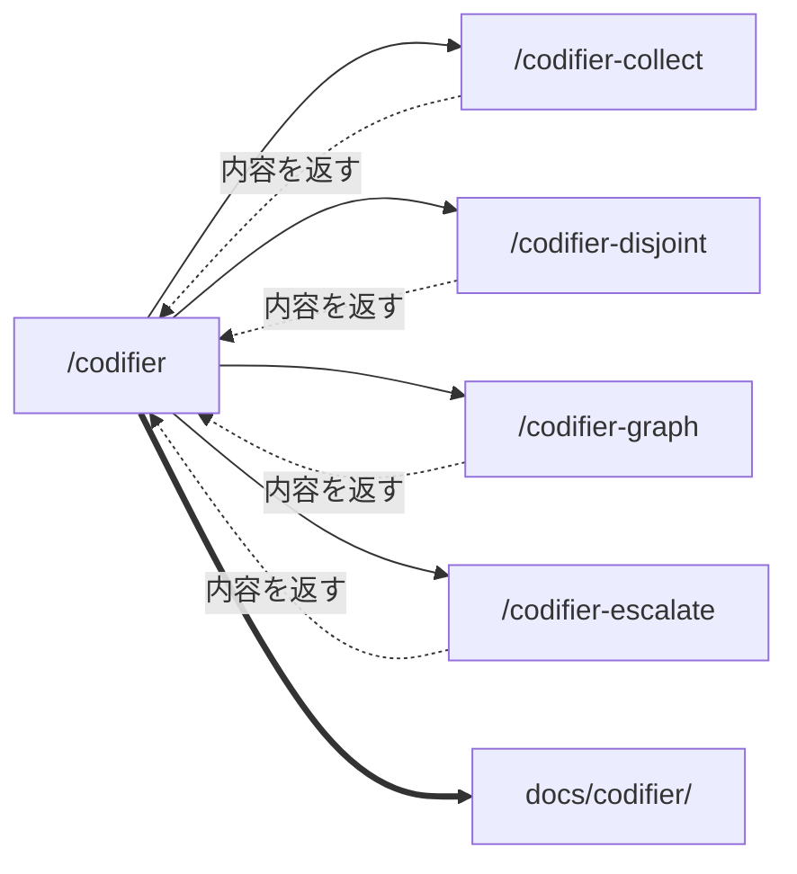
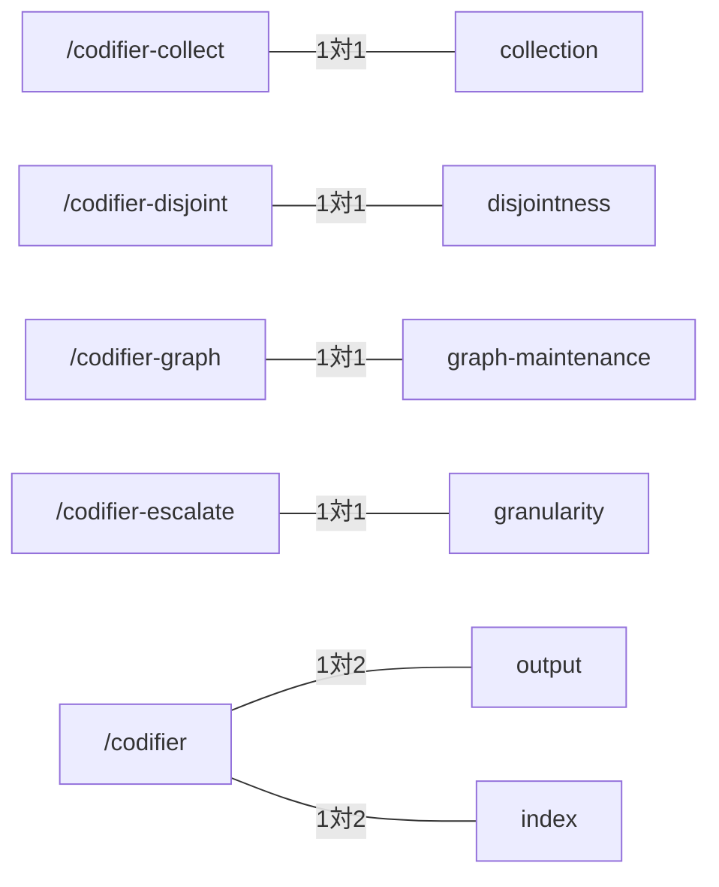

# skill-composition — スキルの構成

## Diagrams

### D1 構成と書き込みの向き

四本は内容を返すだけで、ファイルに触れない。実線が呼び出し、破線が戻り、
二重線が書き込みで、二重線は一本しか無い。
四本のいずれかから `docs/codifier/` へ線が引ける状態は、規則の写しが生まれている。

### D2 コマンドと要件の対応

四本は要件一枚と一対一に対応する。オーケストレーターだけが二枚を負う。
output と index はどの仕事にも属さず、書き込みに従う制約であるため。
片方だけが増えた状態は、起動できるのに要件が無いか、要件だけあって起動できないかを
意味する。

## Decisions
- [スキルは仕事ごとに四つに割る](../L4_decisions/skill-per-job.md)
- [書き込みはオーケストレーターが持つ](../L4_decisions/orchestrator-writes.md)
- [ファイルへの書き込みは一本に集約する](../L4_decisions/single-writer.md)

## References

### Structures

- [writing-path](../L3_structures/writing-path.md)

### Terms

- [article](../L3_terms/article.md)
- [index](../L3_terms/index.md)
