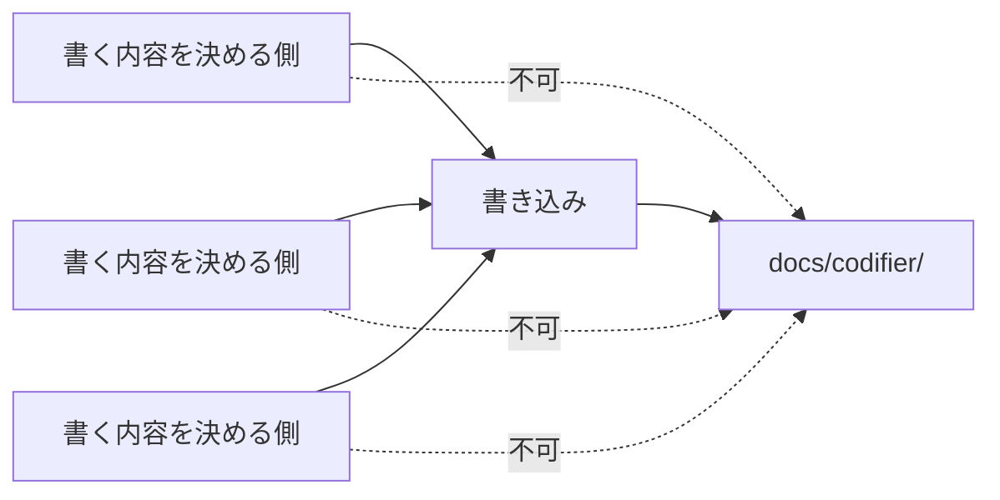

# writing-path — 書き込みの経路

## Diagrams

### D1 書き込みは一点を通る

内容を決める側はいくつあってもよいが、ファイルに触れるのは一点だけ。
出力先の固定と一列配置は、この一点だけが守る。
破線が引けてしまう状態は、規則の写しがそこに生まれていることを意味する。

## Decisions
- [ファイルへの書き込みは一本に集約する](../L4_decisions/single-writer.md)
- [出力先は固定する](../L4_decisions/output-path-is-fixed.md)
- [出力は一列に並べる](../L4_decisions/flat-output-layout.md)

## References

### Structures

- [output-layout](../L3_structures/output-layout.md)

### Terms

- [decision](../L3_terms/decision.md)
