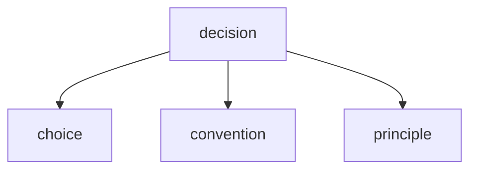
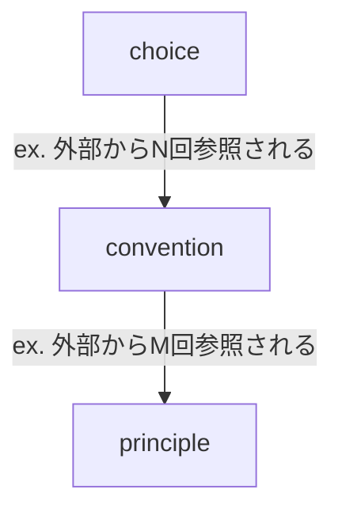
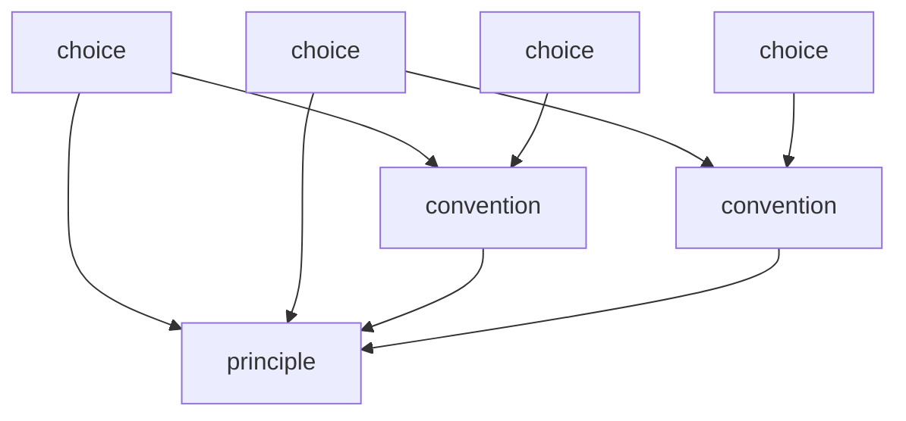

# codifier

従来のワークフローでは、実装群や慣例、既存の事実から構造や語彙の再現ができるものの、決断の再現ができない。
これは、コードを読めば要件や設計が分かる。という既知の謬説を真っ向から覆すことになる。
コードは起きた事実にすぎず、そこに決断プロセスが内包され、隠れる。

このskillでは、実装に隠れた決断や選択を洗い出す。
codeから雑多な決断を抽出し、decisionsとしてまとめる。

## 決断 - decision
- 決断は互いに素である。同じことを2枚が言わない、という意味に限る。
  参照関係を持つことは互いに素であることを妨げない。
- 他の決断からの参照が可能。
- それぞれの決断は粒度と参照を持つ。

## 粒度 - granularity
それぞれの決断には、粒度が存在する。
粒度は参照の数で決まる。そのため、最小粒度の決断が全コードや他の決断群に影響することはない。
また、小さいほど覆しやすい。逆に大きければ覆しにくい。
粒度が拡大するにつれ、決断に記載する内容が増える。この拡大作業を**エスカレーション**と呼ぶ。

- principle(原則) - ADR相当の決断
        a. 決断事項
            <!-- 単一行で説明可能な決断内容 -->
        b. 理由
            <!-- 理由として挙げられる複数の要素 -->
        z. 根拠
            z1. 参照
                <!-- 根拠となる決断の参照 -->
            z2. 実装
                <!-- 実装内容・コミット -->

- convention(慣行)
        a. 決断事項
            <!-- 単一行で説明可能な決断内容 -->
        b. 理由
            <!-- 単一行で説明可能な理由 -->
        z. 根拠
            z1. 参照
                <!-- 根拠となる決断の参照 -->
            z2. 実装
                <!-- 実装内容・コミット -->

- choice(選択) - 最小単位の決断
        a. 決断事項
            <!-- 単一行で説明可能な決断内容 -->
        z. 根拠
            z1. 参照
                <!-- 根拠となる決断の参照 -->
            z2. 実装
                <!-- 実装内容・コミット -->

### エスカレーション
エスカレーションは、粒度を拡大する作業である。
エスカレーションの基準はある程度ユーザー側で設定できるものとする。

エスカレーションは不可逆とする。参照元が覆されて被参照数が閾値を割っても、粒度は下がらない。
降格を認めると、principle の `b. 理由` に書いた複数行が失われる。

## 参照 - reference
個々の決断自体が他の決断を根拠に決まることがある。この場合、ここのdecisionの参照表を用意し、そこに出展元を明示する。
また、すべての決断を配置して、その関係を示す参照グラフを作図する。これで決断同士が参照で循環していないかが確認できる。

### 参照グラフのイメージ

矢印は参照の向きで、根拠にした側へ引く。入ってくる矢印の数が粒度になる。
層構造ではない。choice が convention を経ずに principle を直接参照してよい。
循環が無いことは、この図が描けること自体で確かめられる。

## 決断の覆り

プロジェクトでは当然、決断が覆る場合がある。この場合は参照グラフを追跡して、その参照元に対する影響を検証する。

## チェック機構
決断同士は下記の必要条件を満たす。チェックする機構を設ける。
ex.
- 参照が循環していないか？
- 過去の決断を覆す内容か？
- 過去の決断の複製でないか？
- エスカレーションの対象か？

## 未決定の内容
- 複数の決断をまとめるような現象は起こる？（降格としては起こらない。複製検出の結果として起こるか未定）
-
